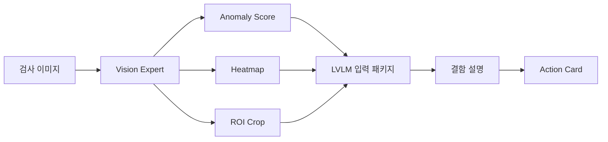

# Explainable Industrial Anomaly Detection

졸업프로젝트 | 2026.03 ~

## 프로젝트 목적

산업 검사 데이터는 정상 이미지가 많고 비정상 이미지는 적은 경우가 많습니다. 이런 환경에서는 단순히 정상/비정상 라벨만 출력하는 모델보다, 이상 의심 위치와 시각적 근거, 위험도, 추가 확인 항목을 함께 제시하는 workflow가 더 중요합니다.

이 프로젝트는 OPGW 송전선로 검사 이미지에서 이상 징후를 탐지하고, LVLM을 활용해 결함 위치와 외형적 근거를 설명하는 explainable anomaly detection 구조를 설계하는 졸업프로젝트입니다. 현재는 OPGW 데이터 검수와 병행해 MVTec AD Cable 데이터를 proxy로 사용해 이상 탐지와 설명 구조를 검증하고 있습니다.

다른 산업 검사 도메인에서도 재사용 가능한 anomaly detection workflow를 만드는 것을 목표로 합니다.

## 구현한 것

정상 데이터 중심의 산업 검사 환경을 고려해 Vision Expert가 anomaly score, heatmap, ROI를 생성하도록 설계했습니다. 이후 LVLM에는 원본 이미지, heatmap, ROI crop, anomaly score, 후보 결함 정보를 함께 입력해 단순 탐지 결과를 설명 가능한 판단 결과로 바꾸는 구조를 만들었습니다.

최종 출력은 단순한 정상/비정상 라벨이 아니라, 엔지니어가 확인할 수 있는 Action Card 형식으로 정리합니다.

## Workflow

## LVLM 입력 구성

LVLM에는 아래 정보를 함께 입력하도록 설계했습니다.

- 원본 검사 이미지
- Vision Expert가 생성한 heatmap
- 이상 의심 영역의 ROI crop
- anomaly score
- 후보 결함 정보
- 구조화된 설명 생성을 위한 domain knowledge prompt

## 최종 출력

Action Card에는 아래 항목이 포함됩니다.

- 의심 결함 유형
- 위치
- 시각적 근거
- 위험도
- 가능 원인 후보
- 추가 inspection 또는 metrology 확인 항목
- 후속 조치 후보

## 기술 스택

Python, anomaly detection, Vision Expert, LVLM, heatmap/ROI analysis, MVTec AD Cable proxy data

## 공개 상태

공개 안전성을 확인한 source code snapshot을 아래 GitHub에 연결했습니다.

https://github.com/arnold6444/explainable-industrial-anomaly-detection

이 repository에는 local dataset, generated output, API key, experiment log, private environment file을 포함하지 않았습니다.

## 다음 보완

- MVTec AD Cable 예시 결과 추가: 원본 이미지, heatmap, ROI crop, LVLM 설명, Action Card
- OPGW 실제 데이터 결과와 proxy data 실험 결과를 분리해 정리
- 최종 발표자료 또는 result report 링크 추가
