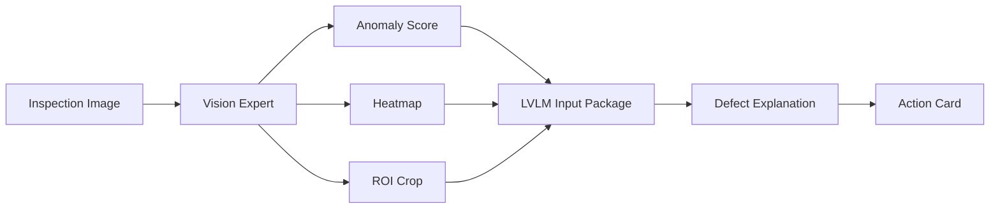

# Explainable Industrial Anomaly Detection

Graduation Project | 2026.03 ~

## Problem

Industrial inspection data is often imbalanced: normal images are much more common than abnormal ones. A model that only outputs a normal/abnormal label is not enough for field use because the user also needs the suspicious location, visual evidence, risk level, and next inspection items.

This project explores an explainable anomaly detection workflow for OPGW transmission-line inspection images. While OPGW data is being curated, MVTec AD Cable data is used as a proxy to verify the anomaly detection and explanation structure.

## What I Built

I designed a workflow that combines a Vision Expert with an LVLM. The Vision Expert generates anomaly score, heatmap, and ROI. The LVLM then receives structured visual evidence and candidate defect information to produce an engineer-readable explanation.

The final output is organized as an Action Card rather than a simple classification label.

## System Workflow

## LVLM Input

The LVLM input is designed to include:

- Original inspection image
- Heatmap generated by the Vision Expert
- ROI crop around the suspicious region
- Anomaly score
- Candidate defect information
- Domain-knowledge prompt for structured explanation

## Final Output

The Action Card contains:

- Suspected defect type
- Location
- Visual evidence
- Risk level
- Possible cause candidates
- Additional inspection or metrology items
- Suggested next action

## Tech Stack

Python, anomaly detection, Vision Expert, LVLM, heatmap/ROI analysis, MVTec AD Cable proxy data

## Public Release Status

The experiment repository exists locally/remotely but is not used as the main CV link yet because the public-facing result page should prioritize workflow, visual examples, and Action Card outputs. A sanitized GitHub source link can be added after confirming that no API keys, private data, raw outputs, or local-only paths are exposed.

## Next Step

- Add MVTec AD Cable example result: original image, heatmap, ROI crop, LVLM explanation, and Action Card.
- Separate OPGW-specific results from proxy-data experiments.
- Add a public report or sanitized GitHub repository after secret and data checks.

