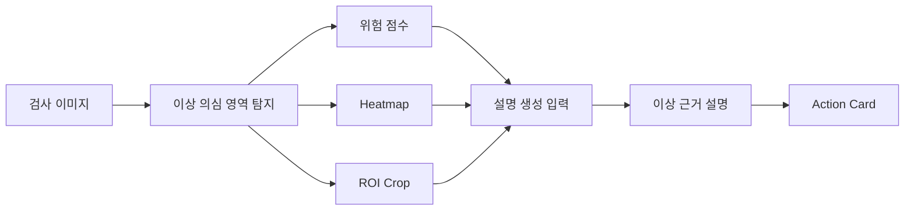

# Explainable Industrial Anomaly Detection

졸업프로젝트 | 2026.03 ~

## 프로젝트 목적

산업 검사에서는 정상 이미지가 많고, 실제 이상 이미지는 적은 경우가 많습니다. 그래서 단순히 정상/비정상 라벨만 보여주는 것보다, 이미지의 어느 부분이 이상해 보이는지와 사람이 무엇을 추가로 확인해야 하는지를 함께 보여주는 흐름이 중요하다고 보았습니다.

이 프로젝트는 산업 설비 검사 이미지에서 평소와 다른 부분을 찾아 표시하고, 검사자가 왜 이상하다고 봐야 하는지 확인할 근거를 정리하는 졸업프로젝트입니다. 원래 목표는 OPGW 송전선로 이미지 검사이며, 현재는 OPGW 데이터 검수와 병행해 MVTec AD Cable 데이터를 proxy로 사용해 `이상 위치 표시 -> 설명 생성 -> Action Card 정리` 흐름을 검증하고 있습니다.

핵심은 AI가 최종 불량 판정을 대신하는 것이 아니라, 검사자가 빠르게 확인할 수 있도록 위치, 근거, 위험도, 추가 확인 항목을 정리해주는 보조 workflow를 만드는 것입니다.

## 구현한 것

정상 이미지가 많은 산업 검사 환경을 고려해, 정상 기준에서 벗어난 영역을 찾고 heatmap과 ROI crop으로 표시하는 구조를 만들었습니다. 이후 원본 이미지, 이상 위치 이미지, 점수 정보를 LVLM에 함께 입력해 시각적 근거와 추가 확인 항목을 문장으로 정리하도록 설계했습니다.

최종 출력은 정상/비정상 라벨이 아니라, 검사자가 확인할 수 있는 Action Card 형식으로 정리합니다.

## Workflow

## LVLM 입력 구성

설명 생성을 위해 아래 정보를 함께 입력하도록 설계했습니다.

- 원본 검사 이미지
- 이상 의심 위치를 표시한 heatmap
- 이상 의심 영역의 ROI crop
- anomaly score
- 후보 결함 정보
- 구조화된 설명 생성을 위한 domain knowledge prompt

## 최종 출력

Action Card에는 아래 항목이 포함됩니다.

- 의심 결함 유형
- 위치
- 시각적 근거
- 위험도
- 가능 원인 후보
- 추가 inspection 또는 확인 항목
- 후속 조치 후보

## 기술 스택

Python, anomaly detection, heatmap/ROI visualization, LVLM-based explanation, MVTec AD Cable proxy data

## 공개 상태

공개 안전성을 확인한 source code snapshot을 아래 GitHub에 연결했습니다.

https://github.com/arnold6444/explainable-industrial-anomaly-detection

이 repository에는 local dataset, generated output, API key, experiment log, private environment file을 포함하지 않았습니다.

## 다음 보완

- MVTec AD Cable 예시 결과 추가: 원본 이미지, heatmap, ROI crop, 설명 결과, Action Card
- OPGW 실제 데이터 결과와 proxy data 실험 결과를 분리해 정리
- 최종 발표자료 또는 result report 링크 추가
