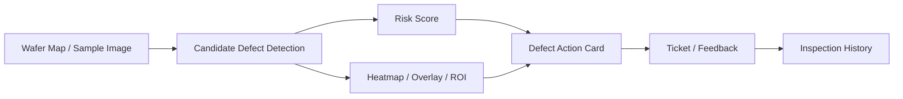

# SemiVision Defect Copilot

Personal Project | 2026.03 ~

## Problem

In manufacturing inspection workflows, a simple normal/abnormal label is often not enough. Engineers need to know where the suspicious region is, why it matters, what should be checked next, and how the decision history is stored. SemiVision Defect Copilot was designed as a quality decision support MVP that connects defect visualization, action guidance, and inspection history.

## What I Built

I implemented an MVP that visualizes suspicious regions in semiconductor inspection images and organizes the result into a Defect Action Card. The project focuses on turning image analysis output into a workflow that an engineer can review, track, and improve through feedback.

The MVP does not claim to diagnose real fab root causes. It uses demo inputs and visual heuristics to show how inspection results can be connected to risk scoring, evidence visualization, and follow-up actions.

## System Workflow

## Key Implementation

- Built a demo environment that accepts wafer map and sample image inputs.
- Extracted suspicious regions using basic visual features such as brightness difference and edge change.
- Generated defect risk score, heatmap, overlay, and ROI crop outputs.
- Designed a Defect Action Card containing suspected defect type, location, visual evidence, additional check items, and recommended actions.
- Stored inspection history, prediction results, action cards, tickets, and feedback in SQLite so the output does not end as a one-time result.

## Tech Stack

Python, Streamlit, OpenCV, scikit-image, scikit-learn, Plotly, SQLite, Docker

## Public Release Status

A public dashboard or source-code link should be added after confirming the current deployable project path and removing local-only data, generated outputs, and private experiment artifacts.

## Next Step

- Add dashboard screenshots: input image, heatmap, overlay, ROI crop, and Defect Action Card.
- Add a public demo dashboard if the app can run reliably.
- Add a sanitized GitHub repository only after checking `.env`, data files, logs, and generated outputs.

