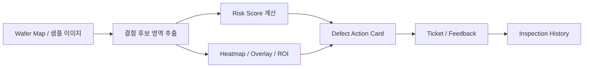

# SemiVision Defect Copilot

개인 프로젝트 | 2026.03 ~

## 프로젝트 목적

제조 검사 workflow에서는 단순히 정상/불량 라벨만 보여주는 것만으로는 부족합니다. 사용자는 이상이 어디에 있는지, 왜 확인이 필요한지, 어떤 항목을 추가로 확인해야 하는지, 판단 이력이 어떻게 남는지를 함께 봐야 합니다.

SemiVision Defect Copilot은 반도체 검사 이미지에서 이상 의심 영역을 시각화하고, 엔지니어가 후속 판단을 할 수 있도록 Defect Action Card와 검사 이력 관리까지 연결한 품질 판단 보조 MVP입니다.

리프라이즈(테디파이)의 봉제 굿즈 제작에서도 검수 단계에서 불량 의심 항목을 찾고, 재확인 항목과 조치 이력을 남기는 구조가 중요할 수 있다고 보았습니다. 따라서 이 프로젝트는 제조 현장의 검수 결과를 사람이 검토 가능한 카드와 이력으로 바꾸는 경험으로 연결할 수 있습니다.

## 구현한 것

반도체 검사 이미지 또는 wafer map 형태의 샘플 입력을 받아 이상 의심 영역을 표시하고, defect risk score, heatmap, overlay, ROI crop을 함께 제공하는 MVP를 구현했습니다.

실제 fab 데이터가 없는 상황을 고려해 demo image와 synthetic wafer map을 사용했고, 밝기 차이와 경계 변화 같은 기본 시각 특징을 활용해 결함 후보 영역을 추출했습니다.

## Workflow

## 주요 구현 내용

- wafer map과 샘플 이미지를 입력으로 받는 데모 환경 구성
- 밝기 차이, 경계 변화 등 기본 시각 특징을 활용해 이상 후보 영역 추출
- defect risk score, heatmap, overlay, ROI crop 생성
- 결함 유형, 의심 위치, 시각적 근거, 추가 확인 항목, 권장 조치 후보를 담은 Defect Action Card 설계
- 검사 결과가 일회성 출력으로 끝나지 않도록 inspection history, prediction, action card, ticket, feedback을 SQLite에 저장

## 기술 스택

Python, Streamlit, OpenCV, scikit-image, scikit-learn, Plotly, SQLite, Docker

## 공개 상태

현재는 공개 dashboard 또는 GitHub 소스 링크를 연결하지 않았습니다. 현재 구현 흐름이 WaferGuard 내부 Action Card/dashboard 기능과 연결되어 있고, 해당 로컬 프로젝트는 작업 중 변경사항이 많기 때문입니다.

공개 전에는 `.env`, data file, log, generated output, private experiment artifact를 제거하고 dashboard 실행 가능 상태를 다시 확인해야 합니다.

## 다음 보완

- 입력 이미지, heatmap, overlay, ROI crop 화면 캡처 추가
- Defect Action Card 화면 캡처 추가
- inspection history, ticket, feedback 흐름 구조도 추가
- 안정적으로 실행되는 dashboard demo 배포 후 링크 연결

