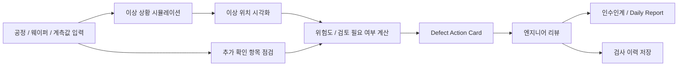

# SemiVision Defect Copilot

개인 프로젝트 | 2026.03 ~

## 프로젝트 목적

제조 검사 workflow에서는 단순히 정상/불량 라벨만 보여주는 것만으로는 부족합니다. 실제 업무에서는 이상이 어디에 있는지, 얼마나 위험한지, 어떤 항목을 추가로 확인해야 하는지, 누가 어떤 판단을 했는지를 함께 남겨야 합니다.

SemiVision Defect Copilot은 반도체 생산 과정에서 검사 이미지나 계측값에 이상이 생겼을 때, 엔지니어가 문제 위치와 위험도, 다음 확인 항목을 한 화면에서 볼 수 있도록 만든 품질 판단 보조 MVP입니다. 핵심은 AI가 최종 판단을 대신하는 것이 아니라, 사람이 판단하기 쉽게 근거와 후속 action을 정리해주는 workflow를 만드는 것입니다.

## 구현한 것

FastAPI backend와 React dashboard를 구성해 검사 실행, 결과 확인, 엔지니어 리뷰, 인수인계 화면을 구현했습니다. 입력은 실제 fab 데이터가 아니라 synthetic wafer image와 가상 계측값을 사용했으며, 실제 데이터처럼 과장하지 않도록 데이터 경계를 문서에 명시했습니다.

검사 요청에는 lot/wafer/line/equipment/process step/recipe 정보와 CD, overlay, film thickness, roughness, defect count, yield proxy 같은 계측값을 함께 입력하도록 설계했습니다. 이후 이상 의심 위치를 wafer map, overlay, ROI crop으로 보여주고, 위험도와 검토 필요 여부를 계산한 뒤 Defect Action Card를 생성합니다.

## Workflow

## 주요 구현 내용

- FastAPI 기반 API와 React 운영 dashboard 구현
- 9가지 wafer defect 상황을 synthetic wafer image로 생성하고 wafer map, overlay, ROI crop으로 이상 위치 시각화
- 공정 단계, 장비, recipe, CD/overlay/thickness 등 계측값을 함께 입력받는 검사 요청 구조 설계
- 계측값과 이상 위치 정보를 바탕으로 위험도와 검토 필요 여부 계산
- Defect Action Card에 의심 원인, 추가 확인할 계측 항목, 공정 점검 항목, 다음 조치, human review rule 정리
- SQLite에 검사 이력, 엔지니어 리뷰, handoff 상태를 저장하고 dashboard에서 review queue, Daily Report 흐름으로 확인 가능하게 구성

## 기술 스택

Python, FastAPI, React, Vite, SQLite, OpenCV, scikit-learn, Recharts

## 공개 상태

민감정보와 실행 산출물을 제거한 private GitHub source snapshot을 준비했습니다.

- 저장소: `arnold6444/semivision-defect-copilot`
- 공개 범위: private
- 포함한 것: FastAPI backend, Action Card logic, synthetic wafer image pipeline, SQLite storage flow, React dashboard source, smoke test
- 제외한 것: `.git`, `.venv`, outputs, node_modules, frontend build output, local execution artifacts

채용 검토 과정에서 코드 확인이 필요하면 접근 권한을 별도로 공유할 수 있습니다.

## 다음 보완

- wafer map, overlay, ROI crop 화면 캡처 추가
- Defect Action Card 화면 캡처 추가
- review queue, handoff, Fab Ops Copilot 흐름 구조도 추가
- 안정적으로 실행되는 dashboard demo 배포 후 링크 연결
