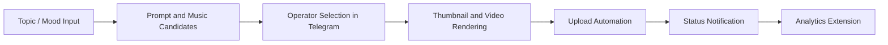

# Youtube Automation System

Personal Project | 2026.03 ~

## Problem

Playlist-style YouTube channel operation involves repeated tasks across prompt writing, visual and music candidate management, thumbnail creation, longform/Shorts rendering, upload, status tracking, and performance review. The goal of this project was to turn that scattered workflow into a Telegram-operated automation pipeline while keeping the final creative decision in the operator's hands.

## What I Built

I implemented a Telegram-based content production and upload automation system for playlist YouTube channel operation. The system supports both longform and Shorts production flows. It lets the operator review content candidates, trigger rendering, check progress, and receive upload/status notifications remotely.

This was designed as a human-in-the-loop workflow, not a fully autonomous upload bot. The operator keeps final control over image and music selection, and the system automates the repetitive execution steps after that decision.

## System Workflow

## Key Implementation

- Built Telegram bot flows for candidate review, production requests, render status checks, and upload actions.
- Managed image generation prompts and music candidates before executing the selected production pipeline.
- Stored project status, candidate sources, thumbnail candidates, and render outputs in SQLite for long-running task tracking.
- Connected the production flow to FFmpeg-based rendering and upload automation.
- Verified the local end-to-end operation flow before server deployment.

## Evidence Links

- Output channel: [saebyeok](https://www.youtube.com/@saebyeok_fi)
- Sample output video: [the sky is quiet enough to stay](https://youtu.be/lJHcvyrVvaw)

## Tech Stack

Python, Telegram Bot, aiogram, SQLite, SQLAlchemy, FFmpeg, Pillow, YouTube Data API/OAuth, browser automation, log-based debugging

## Public Release Status

The source code is not linked here yet because the local project contains environment files, OAuth-related configuration, browser session artifacts, logs, and generated outputs. A public code repository should be released only after a separate sanitization pass.

## Next Step

- Add cleaned screenshots of the Telegram bot flow.
- Add a public pipeline diagram image.
- Prepare a sanitized source-code release or code excerpt repository.
- Add view analytics automation evidence after the workflow is stable.

