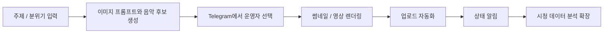

# Youtube Automation System

개인 프로젝트 | 2026.03 ~

## 프로젝트 목적

플레이리스트형 YouTube 채널을 운영하려면 주제 선정, 이미지 프롬프트 작성, 음악 후보 관리, 썸네일 제작, 롱폼/쇼츠 렌더링, 업로드, 상태 확인, 시청 데이터 확인까지 반복 작업이 계속 발생합니다.

이 프로젝트의 목적은 흩어진 콘텐츠 제작 업무를 Telegram에서 원격으로 조작할 수 있는 자동화 workflow로 묶는 것입니다. 다만 이미지와 음악의 최종 선택은 운영자가 직접 하도록 설계해, 완전 자동 업로드보다 콘텐츠 품질 관리와 운영 안정성을 우선했습니다.

리프라이즈(테디파이)의 봉제 굿즈 제작 과정에서도 상담, 샘플, 생산, 검수, 배송처럼 여러 단계의 상태 관리가 필요하다고 보았습니다. 그래서 이 프로젝트는 반복 업무를 task, status, action, feedback 구조로 나누고 자동화하는 경험으로 연결할 수 있습니다.

## 구현한 것

Telegram bot을 콘텐츠 제작 운영 인터페이스로 사용했습니다. 운영자는 Telegram에서 콘텐츠 후보를 확인하고, 제작을 요청하고, 렌더링 진행 상태를 확인하고, 업로드 결과 알림을 받을 수 있습니다.

전체 구조는 human-in-the-loop 방식입니다. 시스템이 이미지 생성 프롬프트와 음악 후보를 관리하고 렌더링/업로드를 자동화하지만, 최종 선택은 운영자가 직접 합니다.

## Workflow

## 주요 구현 내용

- Telegram bot 기반으로 콘텐츠 후보 확인, 제작 요청, 렌더링 상태 확인, 업로드 요청 흐름 구현
- 이미지 생성 프롬프트와 음악 후보를 수집·관리하고 운영자의 최종 선택을 기준으로 제작 pipeline 실행
- 장시간 렌더링과 업로드 상태 추적을 위해 프로젝트 상태, 후보 소스, 썸네일 후보, 렌더링 결과를 SQLite에 저장
- FFmpeg 기반 렌더링과 YouTube 업로드 자동화 흐름 연결
- 실제 서버 배포 전 로컬 서버 환경에서 end-to-end 운영 흐름 검증

## 공개 가능한 근거

- 결과 채널: [saebyeok](https://www.youtube.com/@saebyeok_fi)
- 샘플 영상: [the sky is quiet enough to stay](https://youtu.be/lJHcvyrVvaw)

## 기술 스택

Python, Telegram Bot, aiogram, SQLite, SQLAlchemy, FFmpeg, Pillow, YouTube Data API/OAuth, browser automation, log-based debugging

## 공개 상태

민감정보와 실행 산출물을 제거한 private GitHub source snapshot을 준비했습니다.

- 저장소: `arnold6444/youtube-automation-system`
- 공개 범위: private
- 포함한 것: Python application source, Telegram bot workflow, rendering/upload automation code, README, 실행 예시 문서
- 제외한 것: `.env`, OAuth token, browser profile, data, logs, outputs, generated image/video, local progress log

채용 검토 과정에서 코드 확인이 필요하면 접근 권한을 별도로 공유할 수 있습니다.

## 다음 보완

- Telegram bot 화면 캡처 추가
- 후보 선택 화면과 렌더링 상태 화면 추가
- 전체 pipeline 구조도 이미지 추가
- 시청 데이터 분석 자동화 결과 추가
